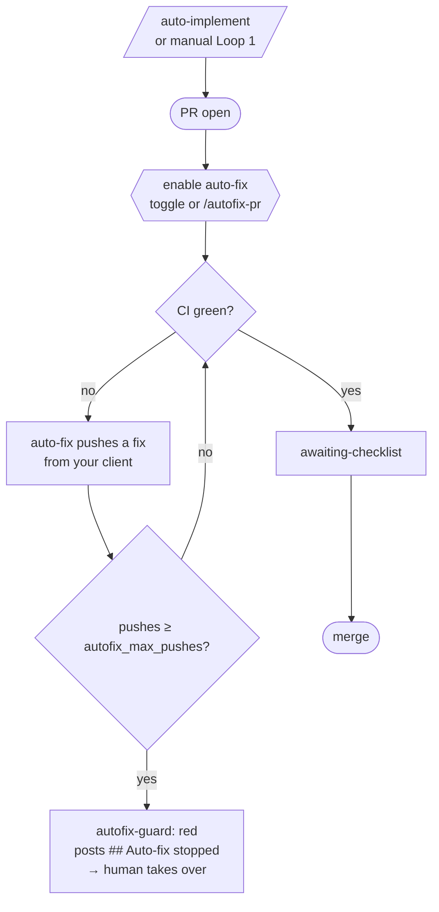
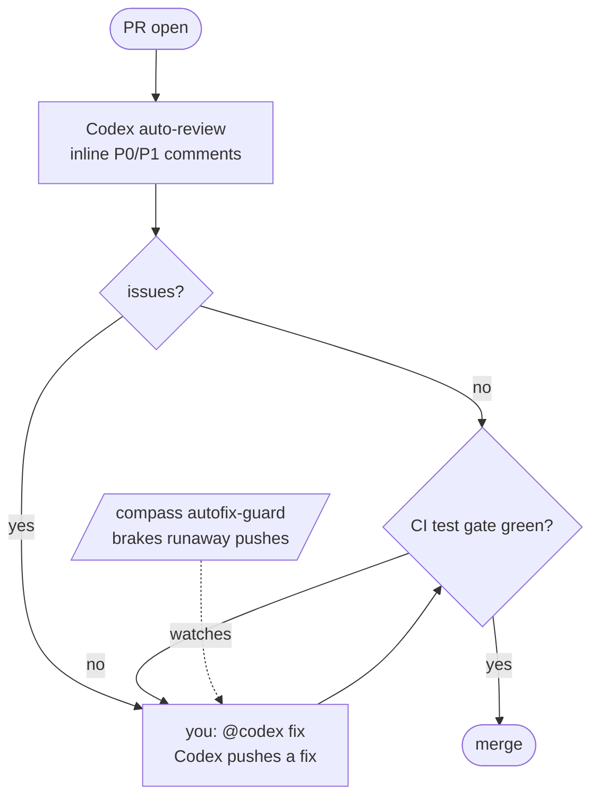

# CI & Autonomy

How compass uses GitHub Actions, and how much you let it do for you.

`/compass:setup-stack` installs one workflow — `.github/workflows/pr-validation.yml`. It is self-contained (reads `.claude/compass.yml`, runs without the plugin) and driven by these config fields:

```yaml
autonomy_mode: off          # off | review-only | full   — how much CI does
ci_review_provider: claude  # claude | openai | gemini    — who reviews
ci_review_model: ""         # blank = provider default    — pin a review model
ci_review_guidelines: .github/review-guidelines.md   # your review conventions (blank = none)
autofix_max_pushes: 0       # 0 = off                     — brake for native auto-fix
```

Edit, commit, and the next PR run picks up the change. No reinstall, no second workflow.

## Contents

- [`autonomy_mode` — how much CI does](#autonomy_mode--how-much-ci-does) — what CI does per mode
- [`ci_review_provider` / `ci_review_model` — who reviews](#ci_review_provider--ci_review_model--who-reviews) — provider, pinned model, your review guidelines
- [Auto-fix the PR loop](#auto-fix-the-pr-loop) — native auto-fix, the `autofix-guard` brake, and [delegating to Codex](#delegating-review--fix-to-an-external-reviewer-codex)
- [Setup](#setup) · [Cost](#cost) · [Security](#security) · [Notes](#notes) · [pre-commit hook](#optional-local-pre-commit-hook)

---

## `autonomy_mode` — how much CI does

Three modes, each a superset of the last.

| Mode | What runs | Use when |
|---|---|---|
| **`off`** | `test` only (lint + types + tests) | default; solo, hand-written logic |
| **`review-only`** | `off` + Claude reviews the diff (inline comments) + posts a manual-test checklist | you want a second pair of eyes + an audit trail |
| **`full`** | `review-only` + auto-merges once all checks are green | bot PRs, low-stakes — **only with a label gate** (below) |

- **`off`** is pure CI — same checks as `/compass:validate`, just on every PR push. No API calls.
- **`review-only`** adds two jobs: **`ci-review`** (status check **"CI review"** — for `claude`, inline comments on code quality, types, test gaps, edge cases, security; for `openai`/`gemini`, one summary comment; never auto-fixes) and **`ci-checklist`** (a `## Manual Verification Before Merge` comment — every provider). It complements `/compass:ship`'s local review: ship runs in your chat with full context; CI posts auditable comments on the PR.
- **`full`** triggers `gh pr merge --auto --squash`. ⚠️ GitHub cannot enforce that you ticked the checklist — it is a prompt, not a gate. For a real gate, require a `ready-for-merge` label in branch protection and add it by hand after ticking. Otherwise auto-merge fires the moment CI is green.

### Comparison

|  | `off` | `review-only` | `full` |
|---|---|---|---|
| API key needed | no | yes | yes |
| `test` (lint + types + tests) | ✓ | ✓ | ✓ |
| `ci-review` (check "CI review") + `ci-checklist` | ✗ | ✓ | ✓ |
| Re-review on each push | ✗ | ✓ | ✓ |
| `auto-merge` | ✗ | ✗ | ✓ |
| Who merges | you | you | **CI** |
| Human merge gate | ✓ | ✓ | ✗ (unless label gate) |
| Cost / PR (Claude) | $0 | ~$0.03 | ~$0.03 |
| Main risk | no second opinion | findings missed (merge stays manual) | **unreviewed merge on green** |

Always present, regardless of mode: the `autofix-guard` brake (when `autofix_max_pushes > 0`), the `## Manual Test Plan` in the PR body (from `/compass:ship`), and any local review you run (`/compass:ship`, `/compass:review-code`).

Two gotchas:
- **Mode on but matching secret missing** → the Claude jobs go red (they do not skip). You get `off` plus failing checks. Keep the key and the mode together.
- **Draft PRs never trigger CI** — the workflow fires only on `opened`, `synchronize`, `ready_for_review`.

---

## `ci_review_provider` / `ci_review_model` — who reviews

`ci_review_provider` picks the LLM (default `claude`):

| Provider | What you get | Secret |
|---|---|---|
| **`claude`** *(recommended)* | inline comments + `## Review Summary` + checklist, via `claude-code-action@v1` | `ANTHROPIC_API_KEY` |
| **`openai`** / **`gemini`** | one `## Review Summary` comment + the checklist (no inline comments) | `OPENAI_API_KEY` / `GEMINI_API_KEY` |

`ci_review_model` pins the model. Blank = the provider default (`claude-code-action` default · `gpt-4o` · `gemini-1.5-pro`). To override, use a full model id, e.g.:

```yaml
ci_review_provider: claude
ci_review_model: claude-sonnet-4-5-20250929
```

`ci_review_guidelines` gives the review **your project's signature**: CI appends that file's content to the review prompt for **every** provider (Claude, OpenAI, Gemini) as higher-priority criteria. `/compass:setup-stack` drops a starter at `.github/review-guidelines.md` and sets this field to it by default — **edit that file** with your conventions. Set blank to disable; a missing file is harmless (the review runs without it).

- The file is read from the checked-out repo → it must be **committed and pushed**; its content is sent to the review provider's API, so keep secrets out of it.
- It's the cross-provider stand-in for a review "skill": the external providers are a plain API call (no agent, no skill system), so the prompt is the only lever — this field is how you pull it.

(`autonomy_mode: off` disables the review for every provider.)

---

## Auto-fix the PR loop

Claude Code can drive an open PR to green for you — watching CI and review comments and **pushing fixes until the checks pass**. This is a **native Claude Code feature, not a compass command.**

**Turn it on** (needs `gh` installed + logged in):
- **Terminal:** `/autofix-pr`
- **Desktop / web:** the **auto-fix** toggle in the PR's CI status bar

Full feature docs: [Claude Code — Desktop](https://code.claude.com/docs/en/desktop).

### compass's brake: `autofix_max_pushes`

Native auto-fix has **no documented stop condition** — on a structural problem it can push fix after fix without ever going green. compass adds a circuit-breaker that watches the PR from outside:

- Set `autofix_max_pushes: N` (`>0`). The `autofix-guard` CI job counts commits on the PR; at `N` it **fails (red)** and posts one `## Auto-fix stopped` comment for a human to take over.
- It is idempotent, independent of `autonomy_mode`, and in `full` mode a tripped guard also blocks auto-merge.
- It rests only on `gh` commit counts — never on auto-fix's internals, so it can't drift. `/compass:status` reports `escalated` once the comment exists.

Pick `N` with headroom — e.g. `6` allows the first push plus a few rounds before calling the PR stuck.

The push-count cap is the **blunt outer brake** — it counts commits, not reasoning. Its per-finding counterpart is the **3-fix boundary** (`references/DEBUGGING.md`): after three failed attempts at the *same* problem, stop patching and re-investigate the root cause (`/compass:debug`), because three misses mean the diagnosis is wrong. The boundary should stop a stuck fix well before the push cap trips.

### The loop end to end



| Actor | Role | Commits? |
|---|---|---|
| **You** | enable auto-fix, set the cap, handle escalation, merge | — |
| **`/compass:auto-implement`** | one-shot, **before** the PR: first implementation → opens PR → stops | yes — once, locally (the only sanctioned local auto-commit) |
| **native `auto-fix`** | iterative, **after** the PR: drives it to green | yes — pushes from your client, **not** CI |
| **`autofix-guard`** | passive brake — trips at the cap | no |
| **`/compass:status`** | reports where the PR stands, derived live | no |

`auto-implement` gets you **to** the open PR; `auto-fix` gets the PR **to green** — sequential, not alternatives. This keeps compass's "CI never commits" rule intact: it's your client pushing, never GitHub Actions.

### Delegating review + fix to an external reviewer (Codex)

Native `auto-fix` is the Claude path. If you live in the OpenAI ecosystem, **Codex's GitHub integration** is the equivalent: it reviews PRs (automatically, or on `@codex review`) and pushes a fix on `@codex fix …`. compass can't drive Codex — it's configured on OpenAI's side ([Codex code review setup](https://developers.openai.com/codex/cloud/code-review)) — so the job is to **hand off cleanly and get out of the way**:

- **Set `autonomy_mode: off`.** compass's own `ci-review`/`ci-checklist` stand down, but the `test` gate (lint + types + tests) still runs on every PR — that's your safety net while Codex reviews.
- **Keep `autofix_max_pushes > 0`.** `autofix-guard` counts pushes from **any** source, so it still brakes a runaway Codex fix loop.
- **Put your conventions in `AGENTS.md`.** That's Codex's equivalent of `ci_review_guidelines` (it applies the closest `AGENTS.md` per changed file).

> **One autonomous fixer per PR.** Codex's `@codex fix` and Claude's `auto-fix` both push fix commits to the branch. Running both = races, churn, and a fast-tripped guard. Pick one and turn the other off. `autofix-guard` is a backstop, not enforcement — compass can't see either toggle (both live outside compass).



**Review-fix loop per provider** — each ecosystem brings its own; compass supplies the `test` gate + the brake:

| Provider | Review | Fix loop |
|---|---|---|
| **Claude** | `ci-review` (claude-code-action) or your client | native `auto-fix` (toggle / `/autofix-pr`) |
| **OpenAI** | Codex (auto / `@codex review`) | Codex (`@codex fix`) |
| **Gemini** | `ci-review` summary comment | **none native** — pair with Claude `auto-fix`, or fix by hand |

---

## Setup

**1. Secret** (for `review-only` / `full`) — set the one matching your provider. Interactive, so run it yourself:

```bash
gh secret set ANTHROPIC_API_KEY   # claude (default) — key at https://console.anthropic.com
gh secret set OPENAI_API_KEY      # openai
gh secret set GEMINI_API_KEY      # gemini
gh secret list                    # verify (names only)
```

`GITHUB_TOKEN` is provided by GitHub automatically. `/compass:setup-stack` checks for the secret but never sets it.

**2. Branch protection** (GitHub → Settings → Branches, rule on `base_branch`):
- Require a pull request before merging
- Require status checks: `test` always; **`CI review`** and **`CI checklist`** in `review-only`/`full` (both names are stable across providers)
- Require branches up to date
- `full` with a hard gate: also require the `ready-for-merge` label

**3. Switching modes** — edit `.claude/compass.yml` and commit. The `config` job re-reads it each run.

---

## Cost

Per PR with `ci_review_provider: claude` (Sonnet 4.6 pricing): `ci-review` ~$0.024 + `ci-checklist` ~$0.009 ≈ **$0.033**. Ten PRs/day ≈ $0.33/day. With `openai`/`gemini` it's two calls (summary + checklist), priced by that provider. Draft PRs are excluded, so they cost nothing.

---

## Security

- **`full` merges without human code review.** Use only with the checklist ticked and ideally a label gate. Multi-contributor repos: prefer `review-only`.
- **Secrets in diffs.** The review reads the diff — a committed secret reaches the API. Add a pre-push scanner (e.g. `gitleaks`).
- **Key scope.** Put rate/budget caps on the `ANTHROPIC_API_KEY` at the Anthropic side.
- **Fork PRs.** GitHub withholds secrets from fork PRs by default, so the Claude jobs fail there unless you opt into `pull_request_target` (research the risks first).

---

## Notes

- **CI never commits.** `ci-review` only surfaces findings — applying them is always a deliberate step (`/compass:fix-ci-review`, or by hand). The one sanctioned auto-commit anywhere is `/compass:auto-implement`. The full fix loop lives in `WORKFLOW.md` → *Loop 2 — Fix*.
- **One review comment per push.** Each `synchronize` re-runs `ci-review` and posts a fresh `## Review Summary` (never edited in place) — a per-round record.
- **`autonomy_mode` is CI-only.** It changes nothing about local commands. `/compass:ship` always runs its local review regardless; `/compass:auto-implement` never merges. For a deeper security pass, run `/compass:review-security` locally.

---

## Optional: local pre-commit hook

A template lives at `${CLAUDE_PLUGIN_ROOT}/templates/husky-pre-commit.sh` — **not installed automatically**:

```bash
npm install --save-dev husky && npx husky init
cp ${CLAUDE_PLUGIN_ROOT}/templates/husky-pre-commit.sh .husky/pre-commit
chmod +x .husky/pre-commit
```

It runs tests and asks Claude for a review, prints findings to your terminal, and **never** auto-fixes or commits. With `/compass:auto-implement`, it fires on the auto-commit as a final safety net (tests + printed review).
