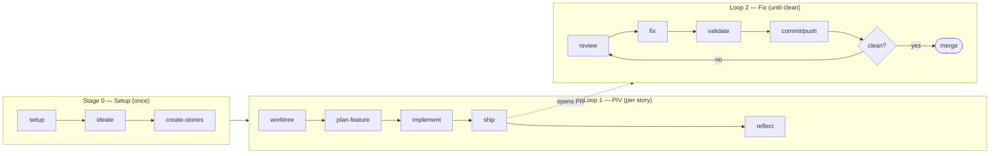
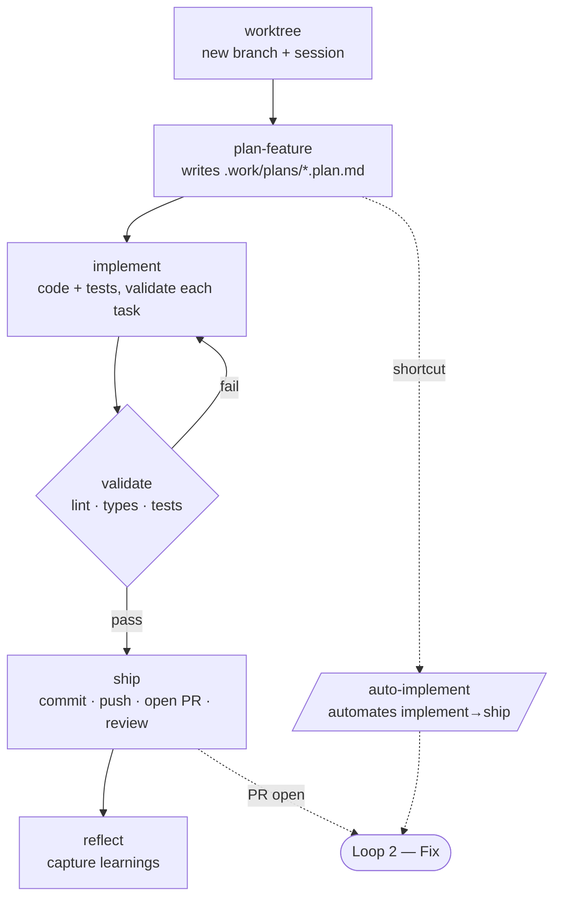
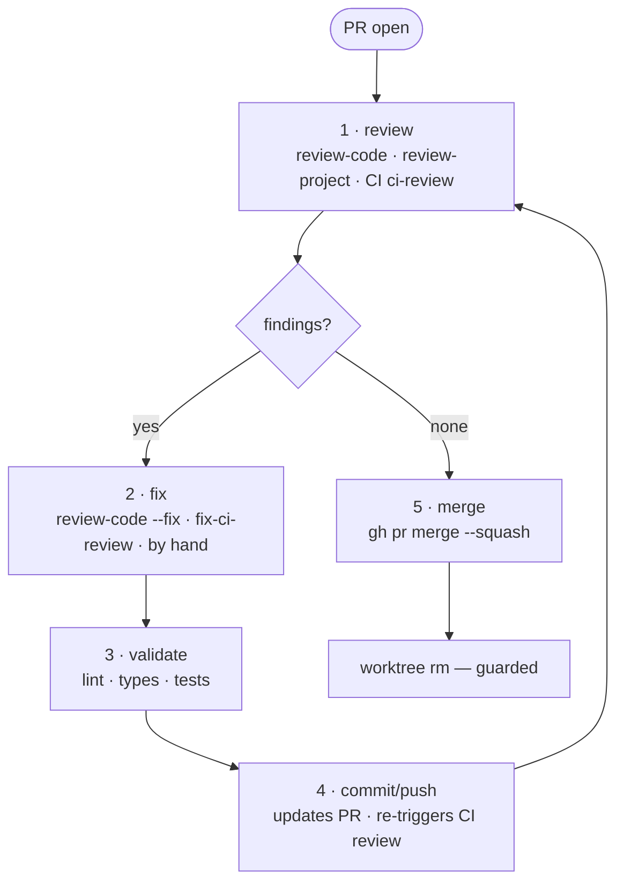

# Workflow

The map of how work flows through this starter: **one setup, two loops, one axis.**

```
STAGE 0 — Setup (once per initiative)   /compass:setup → [/compass:setup-tracker] → /compass:ideate → [/compass:setup-stack] → /compass:create-stories
LOOP 1 — PIV (per story)                /compass:worktree → /compass:plan-feature → /compass:implement → /compass:ship → /compass:reflect
LOOP 2 — Fix (until the PR is clean)    review → fix → /compass:validate → /compass:commit [--push] → (repeat) → merge → cleanup
AXIS — autonomy_mode                    off = Loop 2 stays local · review-only = CI re-reviews each push
```

Each step is one command. The *why* behind the structure: `CONCEPTS.md`. Full command details: `COMMANDS.md`. `.work/` layout, models, glossary, troubleshooting: `HANDBOOK.md`.



---

## Stage 0 — Setup (once per initiative)

Run once when starting a project or a new initiative.

| Step | Command | Details |
|---|---|---|
| 1 | `/compass:setup` | [→ details](COMMANDS.md#compasssetup) |
| 1b | `/compass:onboard` _(brownfield)_ | [→ details](COMMANDS.md#compassonboard) |
| 1c | `/compass:setup-tracker` _(optional)_ | [→ details](COMMANDS.md#compasssetup-tracker) |
| 2 | `/compass:ideate "<initiative>"` | [→ details](COMMANDS.md#compassideate) |
| 2b | `/compass:setup-stack <prd>` _(greenfield only — needs the PRD)_ | [→ details](COMMANDS.md#compasssetup-stack) |
| 3 | `/compass:create-stories <prd>` | [→ details](COMMANDS.md#compasscreate-stories) |

---

## Loop 1 — PIV (per story)

Pick a story from `.work/stories/` (or your tracker), then run this loop once per story.

| Step | Command | Details |
|---|---|---|
| 1 | `/compass:worktree <story-name>` | [→ details](COMMANDS.md#compassworktree) |
| 2 | `/compass:plan-feature <story>` | [→ details](COMMANDS.md#compassplan-feature) |
| 3 | `/compass:implement <plan>` | [→ details](COMMANDS.md#compassimplement) |
| 4 | `/compass:ship` | [→ details](COMMANDS.md#compassship) |
| 5 | `/compass:reflect` | [→ details](COMMANDS.md#compassreflect) |

**Shortcuts:**

| Situation | Command | Replaces |
|---|---|---|
| Single task, no initiative (bug, small addition) | `/compass:plan-feature "description"` | Steps 2 with a free-text description — no story file, no Ideate needed |
| Plan already reviewed and stable | `/compass:auto-implement <plan>` | Steps 3–4 — implement → commit → push → PR-open without confirmation. Hard-stops at PR-open; never merges. Not for DB migrations, auth changes, or first use of a new pattern. |



---

## Loop 2 — Fix (until the PR is clean)

A PR is open. The reviewer points, **you** fix, CI never commits — repeat until clean, then merge. Same loop whether the review is local or in CI; only the trigger differs.

**Step 1 — review** (pick one):

| Command | Details |
|---|---|
| `/compass:review-code [low→ultra]` | [→ details](COMMANDS.md#compassreview-code) |
| `/compass:review-project` | [→ details](COMMANDS.md#compassreview-project) |
| CI `ci-review` | automatic on push in `review-only`/`full` — nothing to invoke |

**Step 2 — fix** (pick one):

| Command | Details |
|---|---|
| `/compass:review-code --fix` | [→ details](COMMANDS.md#compassreview-code) |
| `/compass:fix-ci-review` | [→ details](COMMANDS.md#compassfix-ci-review) |
| `/compass:debug` _(when a fix isn't obvious or has bounced)_ | [→ details](COMMANDS.md#compassdebug) |
| Edit by hand | — |

**Step 3 — verify:** `/compass:validate` — re-run lint/types/tests (a fix can break them).

**Step 4 — publish:** `/compass:commit [--push]` — commit, then push. The push updates the open PR and triggers CI re-review in `review-only`/`full`.

**Step 5 — merge:** `gh pr merge --squash`, then `/compass:worktree <name> rm` (guarded — refuses on unmerged/uncommitted work).



> CI never commits — every fix is a deliberate step you take, then push. `/compass:status` reports which of these states the PR is in.

### Two axes decide your Loop 2

The loop shape never changes. Two **independent** choices decide how you run it — keep them apart and the many review commands fall into place.

**Axis 1 — where it runs** (set by `autonomy_mode`): local in your chat, or in CI on the PR. Not a competition — same loop, different trigger; you can run both.

| | `off` (local) | `review-only` / `full` (CI) |
|---|---|---|
| Who triggers the review | you, each round | CI, automatically on every push |
| Fix entry | `/compass:review-code --fix` (or by hand) | `/compass:fix-ci-review` |
| Re-review after a fix | manual (run it again) | automatic on push |
| "Clean" signal | your judgement | `## Review Summary` with no findings |
| Findings live | in chat (ephemeral) | PR comments (audit trail) |

**Axis 2 — what it checks** (pick per change):

| Command | Checks |
|---|---|
| `/compass:review-code [low→ultra]` | generic bug hunt, tunable effort |
| `/compass:review-project` | project conventions, pattern reuse, test gaps (+ security on risky diffs) — this is what `/compass:ship` runs |
| `ci-review` (CI) | the diff on the PR — inline (claude) or one summary (openai/gemini) |

**Which command when:**

- CI already reviewed the PR? → `/compass:fix-ci-review` — don't re-review the same diff locally.
- No CI (`off`), or before the PR exists? → `/compass:review-code --fix`.
- Specifically "does this fit the project?" (not generic bugs) → `/compass:review-project`.
- The fix entry follows **where the findings live**: chat → `--fix` / by hand; PR → `/compass:fix-ci-review`.
- A failure whose cause isn't obvious, or a fix that already bounced? → `/compass:debug` — root-cause it (four phases, 3-fix boundary) instead of guessing. See `DEBUGGING.md`.

---

## Axis — `autonomy_mode`

A cross-cutting setting (`.claude/compass.yml`), not a step — it decides how Loop 2 runs (see **Axis 1** above): `off` keeps the loop local; `review-only` adds CI review on each push, consumed via `/compass:fix-ci-review`. A third mode, **`full`**, additionally auto-merges on green CI — ⚠️ no human merge gate unless a label gate is configured.

Comparison matrix, cost, and security notes: `AUTONOMY.md`.

---

## Quick Path — trivial changes

For typos, one-line bugfixes, CSS/copy tweaks, config values — a PRD/story/plan is pure ceremony:

```
/compass:worktree <name>  →  make the edit by hand  →  /compass:validate  →  /compass:ship   (answer "no" to the review)
```

**Not for** anything with logic, new files, or acceptance criteria — that goes through Loop 1.

---

## Other commands (folded or on-demand)

These run automatically inside the steps above but can also be invoked directly.

| Command | Auto-runs in | Details |
|---|---|---|
| `/compass:context` | step 1 of `plan-feature` + `implement` | [→ details](COMMANDS.md#compasscontext) |
| `/compass:validate` | end of `implement` | [→ details](COMMANDS.md#compassvalidate) |
| `/compass:commit` | `ship` | [→ details](COMMANDS.md#compasscommit) |
| `/compass:review-security` | `ship` on risky diffs | [→ details](COMMANDS.md#compassreview-security) |
| `/compass:status` | on demand — "where does this feature stand?" | [→ details](COMMANDS.md#compassstatus) |

**Feature state is derived, not stored.** There is no status file to maintain: `/compass:status` recomputes phase/PR/CI/findings live from `git` + `gh` each time you ask. The only durable per-feature notes — decisions and snags hit *during* the loop — live in the plan's `## Loop log` section.

---

Reference: `COMMANDS.md` (every command in detail) · `HANDBOOK.md` (models, `.work/`, glossary, troubleshooting) ·
`CONCEPTS.md` (the why) · `WORKTREES.md` (worktree detail) · `AUTONOMY.md` (CI + `autonomy_mode`) · `DEBUGGING.md` (root-cause method).
