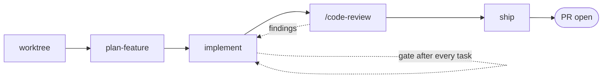
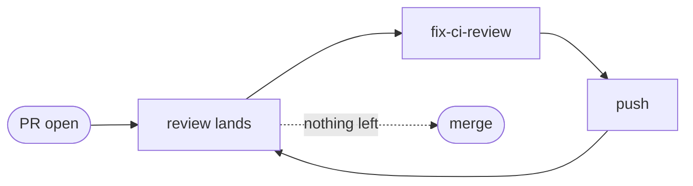
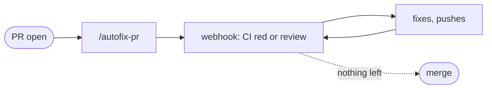

# Workflow

Two compass loops, split by the PR: **Loop 1 ends when the PR is open, Loop 2 is everything after.** Loop 0 is not compass' — it is what you do before there is anything to plan.

```
LOOP 0  decide what to build                                        → a spec
LOOP 1  worktree → plan-feature → implement → code-review → ship    → PR open
LOOP 2  review lands → fix-ci-review → push → repeat                → merge
```

Per-command detail: `COMMANDS.md`. What "done" has to prove, why there is no config file, and what to do when something breaks: `HANDBOOK.md`.

---

## Once per project

```
/compass:setup                 one file: .claude/CLAUDE.md
```

Want your PRs reviewed without asking? That is set up once per repository too — see below. Optional in both loops: Loop 2 needs *a* review, and a human counts.

---

## Automated PR review

Loop 2 starts when a review lands. A human reviewer feeds it perfectly well — these two just do it without being asked. **compass ships neither**, sets up neither, and works with both: `/compass:fix-ci-review` reads whatever review is on the PR.

| | [claude-code-action](https://github.com/anthropics/claude-code-action) | [Codex code review](https://developers.openai.com/codex/cloud/code-review) |
|---|---|---|
| **Set up with** | `/install-github-app` — writes a workflow into your repo | a toggle in Codex settings — nothing lands in your repo |
| **Runs** | every PR and every push to it | every PR once enabled |
| **On demand** | `@claude review this` | `@codex review` |
| **Repo guidance** | `CLAUDE.md` as loaded memory | `AGENTS.md` |
| **Costs** | billed per run, re-charged on every push | your Codex plan |

Both can be on at once. They are independent, and a second opinion on a PR is not a conflict.

### claude-code-action

**Once per repository**, from the repo root, before your first PR. Not per feature, not per PR, not per worktree. `/install-github-app` is Claude Code's command — compass never runs it for you.

It installs the Claude GitHub app and offers two workflows, independently selectable:

| Choice | Effect |
|---|---|
| *Claude Code Review* (`claude-code-review.yml`) | reviews every PR and every push to it, automatically |
| *Claude PR Assistant* (`claude.yml`) | stays quiet until someone comments `@claude` |

Take the first. Take the second too if you also want to ask the PR questions.

**Check the first run.** The generated workflow needs `pull-requests: write` to post at all, and the `code-review` plugin it invokes has an open defect that can burn the run's budget before anything is posted — `HANDBOOK.md` → *Troubleshooting* has both. Neither is compass', and neither announces itself: the workflow goes green either way.

It also sets `ANTHROPIC_API_KEY` as a repo secret.

**Re-run it** to add the workflow you skipped, or to update an existing one; it detects what is already there and asks.

### Codex code review

Connect the repo to Codex cloud, then turn on *Code review* at [chatgpt.com/codex/settings/code-review](https://chatgpt.com/codex/settings/code-review). No workflow file, no repo secret, nothing to commit — which also means nothing for compass to generate or keep in step.

It posts an ordinary GitHub review and flags only its P0 and P1 findings, so what arrives is short. `/compass:fix-ci-review` picks those comments up like any other.

Its repo guidance comes from **`AGENTS.md`**, not the `CLAUDE.md` compass writes — mirror your *Review conventions* section there if you want it honoured. `HANDBOOK.md` → *Why there is no config file* covers which file reaches which reader.

---

## Loop 0 — Think

compass starts at the plan. Deciding *what* to build comes first and belongs to [mattpocock/skills](https://github.com/mattpocock/skills) — install it as a plugin, once:

```bash
claude plugins install mattpocock-skills
```

| Question | Skill |
|---|---|
| What are we actually building? | `mattpocock-skills:grill-with-docs` |
| Write it down as a spec | `mattpocock-skills:to-spec` |
| Cut it into shippable slices | `mattpocock-skills:to-tickets` |
| Too big for one session? | `mattpocock-skills:wayfinder` |
| What's the right module boundary? | `mattpocock-skills:codebase-design`, `…:domain-modeling` |
| Which of these, though? | `mattpocock-skills:ask-matt` |

Whatever comes out — a spec file, a ticket, a sentence — is the argument for step 2 of Loop 1. That is also where you leave mattpocock's flow: `ask-matt` routes its own tickets onward into `mattpocock-skills:implement`, which is his Loop 1, not compass'. Take compass' — the plan file and the per-task gate are the whole point.

Three more from the same source are references, not steps: `tdd` (what makes a good test), `diagnosing-bugs` (a bug that won't die), `improve-codebase-architecture`. compass' commands point at the first two **softly** — not installed, and they fall back to a one-line summary inline.

**Not `npx skills@latest add`** — that route copies the skills in unprefixed, and its `code-review` then shares a name with Claude Code's built-in, silently. Use it only to fork them, and rename that one.

Skip all of it if you already know what to build.

---

## Loop 1 — Build


```mermaid
flowchart LR
    W[worktree] --> P[plan-feature] --> I[implement] --> C["/code-review"] --> S[ship] --> PR([PR open])
    I -. gate after every task .-> I
    C -. findings .-> I
```

| # | Command | Produces |
|---|---|---|
| 1 | `/compass:worktree <name>` | isolated dir + branch + port. Skip it if you build one feature at a time |
| 2 | `/compass:plan-feature <spec>` | a file-level plan in `.work/plans/`. **No code.** The spec is whatever you have — an issue, a file, a sentence |
| 3 | `/compass:implement <plan>` | the code, one task at a time. Each task is validated before the next starts, so broken state never accumulates |
| 4 | `/code-review` | findings on the branch — the cheapest place to fix, no PR exists yet. **Fixed something? Re-run `/compass:validate`.** Claude Code's command, not compass' |
| 5 | `/compass:ship` | commit, push, PR |

---

## Loop 2 — Fix

Everything **after** `/compass:ship`. Runs until the PR is clean. **CI Fix is the path**; Autofix is the exception you reach for deliberately, per PR.

### CI Fix — the default

You stay in the loop. Every fix passes `/compass:validate` before it leaves your machine.


```mermaid
flowchart LR
  PR([PR open]) --> R[review lands] --> F[fix-ci-review] --> C[push]
  C --> R
  R -. nothing left .-> M([merge])
```

| # | Step | Command |
|---|---|---|
| 1 | A review lands on the PR | claude-code-action, Codex, or a human — **not compass**. None arriving on its own? *Automated PR review* above |
| 2 | Apply those findings locally | `/compass:fix-ci-review` — fetches, lists, waits for your go, then validates |
| 3 | Commit and push | `/compass:commit --push` |

**Step 3 restarts step 1.** Repeat until nothing comes back, then merge — compass never merges for you.

Step 2 needs a command because the findings live on GitHub, outside your session — nothing in your context knows they are there.

### Autofix — optional

Run `/autofix-pr` from the PR branch and stop there — a Claude session then watches for red CI and review comments (from any reviewer, a human included), pushes fixes without asking you, and stops when the PR is merged or closed. Claude Code's command, not compass'.


```mermaid
flowchart LR
  PR([PR open]) --> A["/autofix-pr"] --> W[webhook: CI red or review] --> X[fixes, pushes] --> W
  W -. nothing left .-> M([merge])
```

| # | Step | Command |
|---|---|---|
| 1 | Stand on the PR branch with the PR open | it refuses on the default branch, and needs `gh` plus an open PR. Push first — it warns on unpushed commits |
| 2 | Turn monitoring on | `/autofix-pr` — choose **this session** (events arrive as messages here) or **a cloud session** (runs without you) |
| 3 | Nothing | it investigates what arrives and pushes fixes to the PR branch |
| 4 | Read what it pushed, then merge | it stops on its own when the PR is merged or closed |

**Latency:** webhooks are immediate but need the Claude GitHub app *and* Remote Control connected from the mobile or web app. Without both it polls every 30 minutes, so a red run can sit unnoticed that long.

**The trade:** it pushes without asking, so `/compass:validate` never gates those commits. Use it for the PRs you would otherwise leave sitting — a green CI run and a clean review are its bar, not yours.

---

## Quick Path

Typo, one-liner, obvious fix — no plan needed:

```
/compass:worktree → edit → /compass:validate → /compass:ship
```

---

## `mattpocock-skills:code-review` — the spec axis

The one mattpocock/skills command that isn't Loop 0. Step 4 finds bugs; this finds drift — a Spec axis (missing requirements, scope creep) plus a Fowler-smell axis. An addition to step 4, never a replacement.

| | Where | Why there |
|---|---|---|
| **A** | Loop 1, between step 4 and step 5 | scope creep is cheap to cut before the PR exists |
| **B** | Loop 2, once the PR has stopped moving | every fix round added code nobody re-checked against the spec |

A **or** B, not both. **Fixed point is the branch point** either way — against the last push you see the fixes, not the feature.

Worth it only when all three hold:

| | |
|---|---|
| A written spec exists | issue, `to-spec` output, ticket — without it the Spec axis skips and only unverified smells are left |
| The feature is large | several tasks or sessions; drift needs room to happen |
| `docs/agents/issue-tracker.md` exists | `mattpocock-skills:setup-matt-pocock-skills`, else it can't resolve the issue from commit messages |

Skip it on the Quick Path, and whenever you skipped Loop 0 — no spec, no axis.

---

## Where compass stops

compass owns Loop 1 and `/compass:fix-ci-review`. Loop 0 is mattpocock/skills, `/code-review` and `/autofix-pr` are Claude Code's, PR review is claude-code-action's. Shipping a worse copy of any of them was the whole problem.
